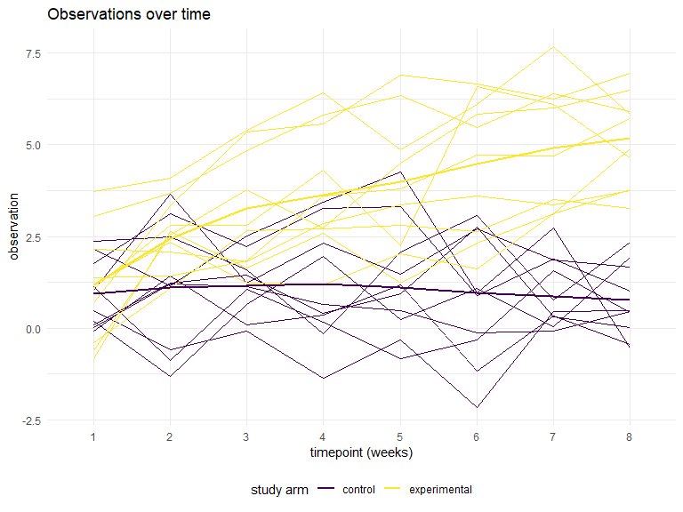

Homework 5
================
Ford Holland
11/2/2019

## Problem 1

``` r
replace_na = function(x) {
  if (!(is.numeric(x) | is.character(x))) {
    stop("This function only supports numeric and character arguments.")
  } else if (is.numeric(x)) {
    x = replace(x, is.na(x), mean(x, na.rm = TRUE)) %>% 
      round(1)
    return(x)
  } else if (is.character(x)) {
    x = replace(x, is.na(x), "virginica")
    return(x)
  }
}
```

``` r
iris_imputed = map_df(.x = iris_with_missing, ~replace_na(.x))
```

## Problem 2

``` r
df = tibble(
  file = list.files("data")
) %>% 
  mutate(
    data = map(str_glue("data/{file}"), read_csv) %>% 
      map(pivot_longer, 
          week_1:week_8,
          names_to = "week", 
          values_to = "observation",
          names_prefix = "week_"),
    file = str_replace(file, "\\..*", "")
  ) %>% 
  rename(id = file)
```

It seems the treatment received by the experimental arm has a detectable
effect. The observations for the experimental arm increase sharply in
the first three weeks and continue the trend at a slightly lower rate
over time. The control group’s observations remain consistent over time.

``` r
df %>% 
  unnest(cols = data) %>% 
  mutate(
    group = factor(str_detect(id, "con"), 
                   levels = c(TRUE, FALSE),
                   labels = c("control", "experimental"))
  ) %>% 
  ggplot(aes(x = week, y = observation, group = id, color = group)) +
  geom_line() +
  geom_smooth(aes(group = group), se = FALSE) +
  labs(title = "Observations over time",
       x = "timepoint (weeks)",
       y = "observation",
       color = "study arm")
```

    ## `geom_smooth()` using method = 'loess' and formula 'y ~ x'



## Problem 3

``` r
sim_regression = function(beta_1) {
  sim_data = tibble(
    x1 = rnorm(30, mean = 0, sd = 1),
    y = 2 + beta_1 * x1 + rnorm(30, 0, sqrt(50))
  )
  
  ls_fit = lm(y ~ x1, data = sim_data)
  
  broom::tidy(ls_fit) %>% 
    janitor::clean_names() %>% 
    filter(term == "x1") %>%
    select(estimate, p_value)
}
```

``` r
sim_results = 
  rerun(10000, sim_regression(beta_1 = 0)) %>% 
  bind_rows()
```

The plot below demonstrates that as the size of an effect increases, it
becomes more likely that a false hypothesis will be rejected. The power
of a test therefore increases with the with effect size.

``` r
sim_results = 
  tibble(
    beta_1 = 1:6
  ) %>% 
  mutate(
    output_lists = map(.x = beta_1, ~rerun(10000, sim_regression(beta_1 = .x))),
    estimate_dfs = map(output_lists, bind_rows)
  ) %>% 
  select(-output_lists) %>% 
  unnest(estimate_dfs)
```

``` r
sim_results %>% 
  group_by(beta_1) %>%
  mutate(null_rejected = as.numeric(p_value < 0.05),
         prop_rejected = mean(null_rejected)) %>% 
  ggplot(aes(x = beta_1, y = prop_rejected)) +
  geom_bar(stat = "identity") +
  scale_x_continuous(breaks = 1:6) +
  labs(title = "Proportion of rejected hypotheses by effect size",
       x = "coefficient value", 
       y = "percent rejected")
```


When the effect size is small, the sample averages of significant
estimates do not approximate the true effect size very accurately. As
the true effect size increases, the averages converge to the true value.
Small effects are more difficult to detect, so when the true effect is
small, the larger estimates are those found to be significant on
average.

``` r
sim_results %>% 
  group_by(beta_1) %>% 
  mutate(
    null_rejected = as.numeric(p_value < 0.05),
    avg_estimate = mean(estimate)
  ) %>% 
  group_by(beta_1, null_rejected) %>%
  mutate(
    avg_sig_estimate = mean(estimate),
    avg_sig_estimate = replace(avg_sig_estimate, p_value >= 0.05, NA)
  ) %>% 
  drop_na() %>%
  ggplot(aes(x = beta_1)) +
  geom_line(aes(y = avg_estimate, color = "all estimates")) +
  geom_line(aes(y = avg_sig_estimate, color = "null rejected")) +
  scale_x_continuous(breaks = 1:6) +
  labs(title = "True effect size vs. average estimated effect size",
       x = "true effect size",
       y = "average of estimated effect sizes",
       color = "")
```


<br> <br>
